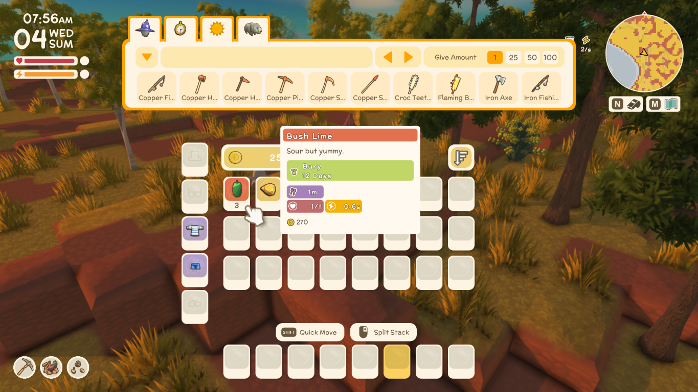
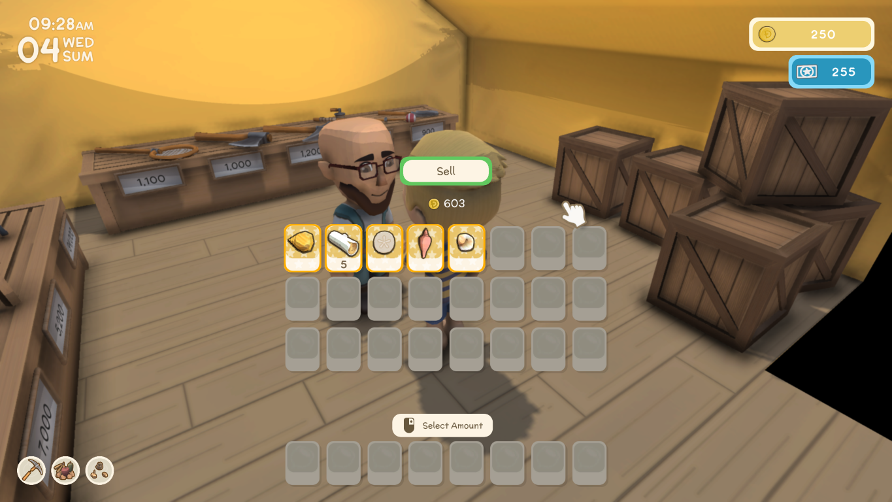

# Dinkum Value Tooltip

<a href="https://www.nexusmods.com/dinkum/mods/406">
    
</a>

A mod that adds the ability to see the value of items in the inventory. And, the ability to see the total value of selected items in the sell menu.

## Requirements
- Dinkum v1.0.7
- [MelonLoader v0.7.1 Beta](https://github.com/LavaGang/MelonLoader)
- [DivineDinkum](https://github.com/Decapitated/DivineDinkum) v1.0.0

## Features
| Value Tooltip |
| - |
|  |

| Total Sell Value |
| - |
|  |

## Contributing
Before making changes, update `DinkumPath` in the `Directory.Build.props` file to the absolute path of your `Dinkum` game folder.

To prevent committing changes to `Directory.Build.props`, run:
```
git update-index --skip-worktree Directory.Build.props
```

To allow committing changes to `Directory.Build.props`, run:

```
git update-index --no-skip-worktree Directory.Build.props
```
